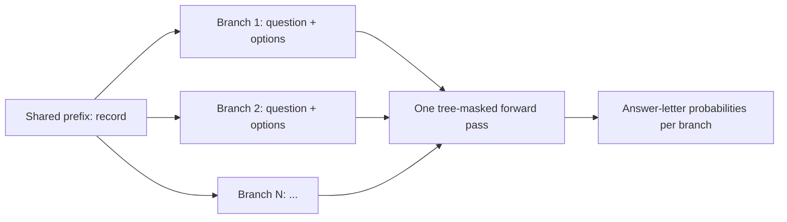

# qwen3-4b-system-one

Ask several questions about one record in **a single forward pass**. This repository is the source of the inference code for the [`qwen3-4b-system-one-lora`](https://huggingface.co/sennaLLMLearner/qwen3-4b-system-one-lora) LoRA adapter on [Qwen/Qwen3-4B-Instruct-2507](https://huggingface.co/Qwen/Qwen3-4B-Instruct-2507), with PyTorch and Apple Silicon MLX backends.

> Experimental research artifact. English-oriented; not for high-stakes decisions. Not affiliated with Qwen/Alibaba Cloud, DeepSeek, or TypeSafe.

## Speed

Answering N questions about one record in a single tree-masked forward pass, versus N separate forward passes:

__omp_shell("[Latency vs question count on Apple M2](docs/latency.png)")

| Questions per record | 2 | 4 | 8 | 16 |
| --- | ---: | ---: | ---: | ---: |
| Speedup, MLX | 1.77× | 2.42× | 3.01× | **3.42×** |
| Speedup, PyTorch MPS | 1.67× | 2.19× | 2.65× | **2.95×** |

Apple M2 (24 GB), fp16, public fictional fixture, median request latency. Reproduce with `scripts/bench_latency.py`; details in [docs/RESULTS.md](docs/RESULTS.md#latency-tree-masked-packing-vs-one-forward-per-question).

## How it works



- Each question is rendered as a Qwen chat prompt. The prompts' common token prefix (the record) is stored once; each question's suffix becomes a branch.
- A causal **tree attention mask** lets a branch attend to the shared prefix and its own tokens, never to another branch. Position IDs restart after the prefix for every branch.
- The native LM head reads the answer-letter logits (`A`, `B`, …) at the end of each branch. Nothing is generated.

The tree mask lives in this code, **not in the LoRA weights**. Loading the adapter into a normal `text-generation` pipeline does not reproduce this behavior.

## Install

PyTorch and MLX pin different `transformers` versions; use separate environments.

```bash
git clone https://github.com/senna-lang/qwen3-4b-system-one && cd qwen3-4b-system-one
python -m venv .venv && . .venv/bin/activate

pip install -e '.[torch]'   # CUDA, Apple MPS, or CPU
# or, on Apple Silicon:
pip install -e '.[mlx]'
```

## Run the examples

```bash
python examples/run_example.py --backend torch   # or --backend mlx
```

The script downloads the adapter (`adapter_config.json`, `adapter_model.safetensors`) and the Qwen base model from the Hugging Face Hub on first use, then scores the fictional requests in [`examples/requests.jsonl`](examples/requests.jsonl). Use `--adapter /path/to/dir` to load a local copy instead.

## Python API

```python
from huggingface_hub import snapshot_download
from system_one import Branch, PackedRequest
from system_one.inference import load_model, predict_request   # or system_one.inference_mlx

adapter = snapshot_download("sennaLLMLearner/qwen3-4b-system-one-lora",
                            allow_patterns=["adapter_config.json", "adapter_model.safetensors"])
model, tokenizer = load_model(adapter)
request = PackedRequest(
    state="A customer received a replacement device after the first one stopped charging.",
    branches=[
        Branch("choice", "Which issue is described?", ["Delivery delay", "Charging failure", "Billing error"]),
        Branch("noul", "Does the record mention a replacement?"),
    ],
)
probabilities = predict_request(model, tokenizer, request)
# probabilities[0]: [P(Delivery delay), P(Charging failure), P(Billing error)]
# probabilities[1]: [P(No), P(Yes)]
```

| Branch kind | `options` | Output |
| --- | --- | --- |
| `choice` | 2–20 options | one probability per option |
| `score` | 2–20 ordered rating levels | one probability per level; compute `sum(level * p)` with your own level values for an expected score |
| `noul` | empty (fixed `[No, Yes]`) | `[P(No), P(Yes)]` |

Probabilities are **conditional on the listed options** and are not guaranteed to be calibrated. This code uses one canonical option order; it does not average over option orders.

## Tests

```bash
pip install -e '.[test]' && pytest
```

The tests use a stand-in tokenizer and need no model weights. They check request validation, prefix sharing, branch spans, and position IDs.

## Verification

[`fixtures/behavior.jsonl`](fixtures/behavior.jsonl) is a small fictional fixture for checking behavior with the real adapter:

- `scripts/check_branch_isolation.py` — a branch's probabilities do not change when other branches are added, reordered, or removed (max diff 0.0074 vs 0.84 without the tree mask).
- `scripts/compare_backends.py` — PyTorch and MLX agree (42/42 argmax, max diff 0.016).
- `scripts/bench_latency.py` — request latency of tree-masked packing vs one forward per question.

See [docs/RESULTS.md](docs/RESULTS.md) for commands and numbers, and [docs/METHOD.md](docs/METHOD.md) for the prompt, packing, and mask.

## Evaluation

The numbers below were measured on data that is **not distributed**, so they cannot be re-run by third parties. They are reported results, not a public benchmark.

On 1,200 held-out branches, compared with the soft answer distributions of the DeepSeek Flash teacher (not human labels):

| Model | Teacher top-1 ↑ | Brier ↓ | NLL ↓ | ECE ↓ |
| --- | ---: | ---: | ---: | ---: |
| Qwen3-4B-Instruct-2507, no adapter (order-averaged) | 0.8417 | 0.0663 | 1.374 | 0.102 |
| LoRA (order-averaged) | **0.8792** | **0.0369** | **0.326** | **0.030** |
| LoRA, single canonical order (this code) | 0.8767 | 0.0391 | 0.344 | 0.032 |

The project's prespecified target of a +5-point top-1 gain was **not met** (+3.75), and Score-type performance remains below its intended threshold. See the [model card](https://huggingface.co/sennaLLMLearner/qwen3-4b-system-one-lora) for training details and limitations.

## License

Apache-2.0 (see [`LICENSE`](LICENSE)). The Qwen base model is obtained separately under its own license. See [`THIRD_PARTY.md`](THIRD_PARTY.md).
