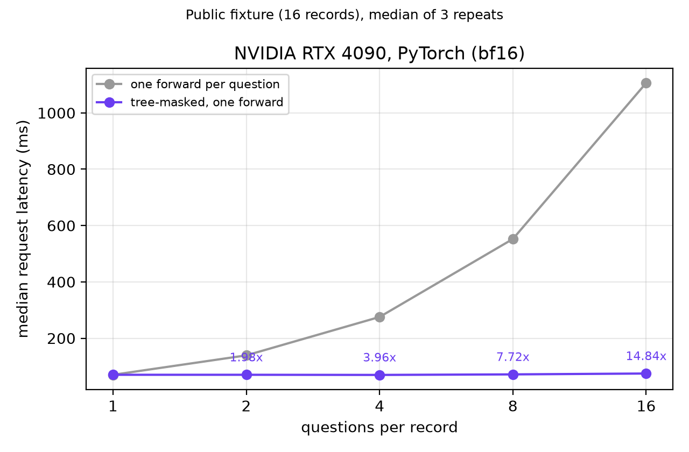
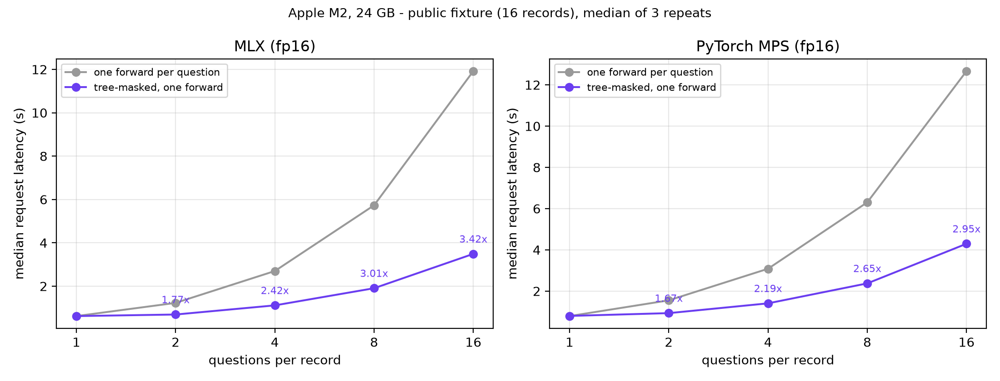

# Results

This page separates two kinds of evidence.

| Kind | Who can re-run it | Section |
| --- | --- | --- |
| Behavior checks on the public fixture | Anyone with the adapter | [Reproducible checks](#reproducible-checks) |
| Quality evaluation on undistributed data | Nobody outside the project | [Reported evaluation](#reported-evaluation-not-reproducible) |

## Reproducible checks

[`fixtures/behavior.jsonl`](../fixtures/behavior.jsonl) holds 16 fictional records with 42 branches (16 `choice`, 10 `score`, 16 `noul`), written for this repository. They test behavior, not accuracy: there are no labels.

### Branch isolation

```bash
python scripts/check_branch_isolation.py --backend torch --output outputs/isolation-torch.json
python scripts/check_branch_isolation.py --backend mlx   --output outputs/isolation-mlx.json
```

Each branch is scored packed with the others, packed in reverse order, and alone. The script reports the largest absolute probability difference among the three and whether the argmax matches.

Measured on an Apple Silicon Mac (2026-10-01):

| Backend | Branches | Max abs diff | Argmax agreement |
| --- | ---: | ---: | ---: |
| PyTorch (MPS, fp16) | 42 | 0.0074 | 42/42 |
| MLX (fp16) | 42 | 0.0074 | 42/42 |

Negative control: replacing the tree mask with a plain causal mask (each branch can see earlier branches) and contiguous positions raised the MLX max difference between packed and alone to **0.84**. The check therefore detects leakage between branches; the remaining 0.0074 is fp16 numerical noise from different sequence layouts. The default tolerance is 0.01.

### PyTorch vs MLX

```bash
python scripts/compare_backends.py predict --backend torch --output outputs/torch.jsonl   # torch env
python scripts/compare_backends.py predict --backend mlx   --output outputs/mlx.jsonl     # mlx env
python scripts/compare_backends.py compare outputs/torch.jsonl outputs/mlx.jsonl
```

| Branches | Max abs diff | Mean per-branch max diff | Argmax agreement |
| ---: | ---: | ---: | ---: |
| 42 | 0.0156 | 0.0012 | 42/42 |

The default tolerance is 0.02. Results on other hardware (for example CUDA in bf16) may differ more and have not been measured here.

### Latency: tree-masked packing vs one forward per question

```bash
python scripts/bench_latency.py --backend mlx   --output outputs/latency-mlx.json
python scripts/bench_latency.py --backend torch --output outputs/latency-torch.json
```

Each fixture record is asked N questions (its own branches, repeated cyclically). The same N questions are answered either in one tree-masked forward pass or in N separate forward passes that each re-encode the record. Model loading is excluded; times are medians over 16 records × 3 repeats.

#### NVIDIA RTX 4090 (2026-10-02)



Median request latency, PyTorch 2.10.0+cu128, public fixture (16 records × 3 repeats), model loading excluded:

| Questions per record | 1 | 2 | 4 | 8 | 16 |
| --- | ---: | ---: | ---: | ---: | ---: |
| **One tree-masked forward pass** | 70 ms | 70 ms | 70 ms | 72 ms | 75 ms |
| One forward pass per question | 70 ms | 139 ms | 275 ms | 552 ms | 1,106 ms |
| Speedup | 1.00× | 1.98× | 3.96× | 7.72× | 14.84× |

On the GPU a forward pass over a few hundred tokens costs about 70 ms regardless of length, so packed requests stay flat while one-pass-per-question grows linearly. Fixture records are one or two sentences; long-document latency has not been measured.

#### Apple M2



Measured on an Apple M2 (24 GB), fp16, no other GPU workload (2026-10-02):

| Questions | Packed tokens | MLX tree | MLX per-question | Speedup | MPS tree | MPS per-question | Speedup |
| ---: | ---: | ---: | ---: | ---: | ---: | ---: | ---: |
| 1 | 82 vs 82 | 0.62 s | 0.62 s | **1.00×** | 0.80 s | 0.79 s | **0.99×** |
| 2 | 106.5 vs 156.5 | 0.69 s | 1.23 s | **1.77×** | 0.93 s | 1.55 s | **1.67×** |
| 4 | 167 vs 316 | 1.11 s | 2.70 s | **2.42×** | 1.41 s | 3.08 s | **2.19×** |
| 8 | 281 vs 626.5 | 1.91 s | 5.73 s | **3.01×** | 2.37 s | 6.30 s | **2.65×** |
| 16 | 517 vs 1260 | 3.49 s | 11.92 s | **3.42×** | 4.30 s | 12.67 s | **2.95×** |

The gain comes from encoding the record once: at N = 16 the packed sequence is 517 tokens instead of 1,260. Records in this fixture are short (one or two sentences), so longer records should benefit more; that has not been measured. Absolute times are for a laptop GPU and are not a deployment latency claim; CUDA has not been measured.

## Reported evaluation (not reproducible)

These results were measured on data that is not distributed (training texts and teacher outputs). They are reported for context and cannot be re-run from this repository.

On 1,200 held-out branches (397 Choice, 448 Score, 355 Noul), predictions were compared with the soft answer distributions of the DeepSeek Flash teacher, not with human labels. Order-averaged rows pack option-order variants (four for Choice/Score, two for Noul) as extra branches in the same forward pass and average them.

| Model | Teacher top-1 ↑ | Brier ↓ | NLL ↓ | ECE ↓ |
| --- | ---: | ---: | ---: | ---: |
| Qwen3-4B-Instruct-2507, no adapter (order-averaged) | 0.8417 | 0.0663 | 1.374 | 0.102 |
| LoRA (order-averaged) | **0.8792** | **0.0369** | **0.326** | **0.030** |
| LoRA, single canonical order (this code) | 0.8767 | 0.0391 | 0.344 | 0.032 |

The prespecified target of at least +5 points in top-1 was not met (+3.75). Score-type branches remain the weakest; for example, in `examples/requests.jsonl` the adapter rates a deployment that timed out twice as "Not disruptive" (p = 0.725).

A separate small final evaluation (60 private records, 90 branches) and a latency measurement are described in the [model card](https://huggingface.co/sennaLLMLearner/qwen3-4b-system-one-lora); neither is reproducible from this repository.
